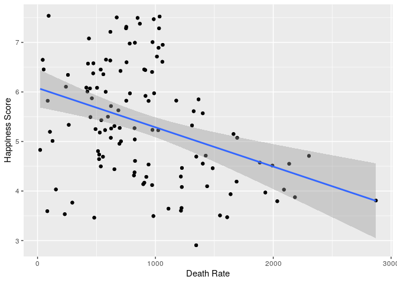
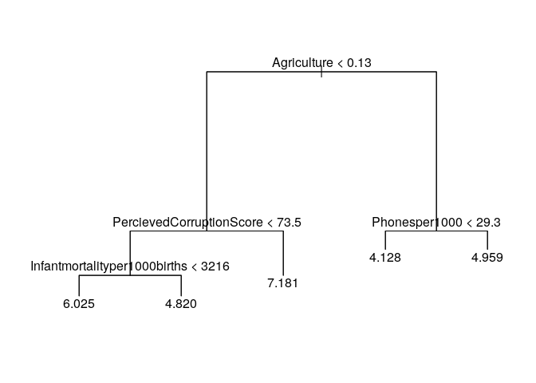
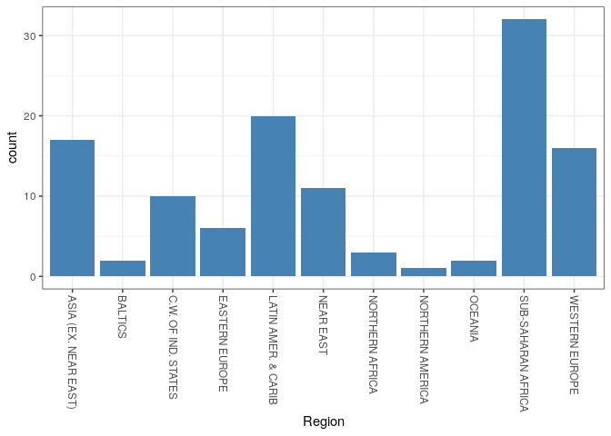

# Predicting Happiness, an Attempt

The final project of our Fall 2019 Statistical Learning class, by Alyssa
Andrichik, Eva Licht, and Joe Yalowitz.

### Abstract

We investigate the World Happiness Index in order to build a model that
can predict a country’s happiness score based on demographic and
geographic factors such as literacy levels, cell-phone use, birth rate,
death rate, GDP per capita, perceived corruption, etc. We build an array
of linear models, simple and with interaction, and use other regression
analysis tools such as ridge, lasso, and principal component analysis to
understand our data. We also use regression trees, random forests, and
boosted trees to develop prediction methods for our research question.
We determine that a country’s region is the best predictor of its
happiness score.

### Introduction

Happiness can define a country. Beyond the great importance of
individual and communal well-being that accompanies happiness and
positive emotions, studies show that positive emotions contribute to
“broadening workers” individual mindsets, enabling them to build up
their personal resources in terms of enhanced sensitivity and positive
attitudes toward their workplace,” and can increase productivity (De
Satio 2019). Predicting a country’s happiness can aid governments in
supporting their citizens and ensure greater well-being.

In terms of data analysis, we employed both data model analysis and
algorithmic model analysis. Two primary research questions guided our
project. First, can we use a mixture of demographic and geographic data
to predict happiness for a country? Second, is there a significant
difference in happiness score between regions of the world, and is
region a significant predictor of happiness?

### The Data

Our final dataset pulls data from a wide variety of sources. We obtained
our “happiness” data from the Gallup World Poll. Our demographic data on
countries came from the US Government. Data on corruption came from
Transparency International. We combined these disparate sources into one
data set with 120 observations and 22 variables. Each observation refers
to a country of the world. These combinations created our complete
dataset, but required immense data wrangling. As the sources differed,
merging by country resulted in errors because each data set recorded
country name differently. We had to mutate the data to eliminate these
differences: changing all three data sets to reporting “United States”
rather than “The United States” or “United States of America.”
Additionally, the data was collected by several different organizations,
and some data had commas to signify decimals, rather than periods.
Variable names had to be normalized and checked for any possible causes
of error; for example, GDP per capita was originally reported as “GDP ($
per capita)” and the dollar sign prompted errors in the code. After
fixing the variable names, merging, and checking the data reporting
format, the data was ready for its initial analysis.

### Exploratory Data Analysis

    #> `geom_smooth()` using formula 'y ~ x'

 Adjusted
R-squared: 0.4808

``` r
mod5<- lm(HappinessScore~GDP_percapita, data=happy_country)
ggplot(happy_country, aes(x=GDP_percapita, y=HappinessScore)) +
  geom_point()+
  labs(x="GDP Per Capita", y="Happiness Score") +
  geom_jitter()+
  stat_smooth(method = "lm")
#> `geom_smooth()` using formula 'y ~ x'
```


Adjusted R-squared: 0.5964

``` r
lm1<- lm(HappinessScore~Literacy, data= happy_country)
lmplot1<- ggplot(happy_country, aes(x = Literacy, y = HappinessScore)) +
  geom_point() +
  labs(x="Literacy", y="Happiness Score")+
  geom_jitter() +
  stat_smooth(method = "lm")
lmplot1
#> `geom_smooth()` using formula 'y ~ x'
```


``` r
lm2<- lm(HappinessScore~Birthrate, data= happy_country)
lmplot2<- ggplot(happy_country, aes(x = Birthrate, y = HappinessScore)) +
  geom_point() +
  labs(x="Birthrate", y="Happiness Score")+
  geom_jitter() +
  stat_smooth(method = "lm")
lmplot2
#> `geom_smooth()` using formula 'y ~ x'
```


Adjusted R-squared: 0.292

``` r
lm3<- lm(HappinessScore~Deathrate, data= happy_country)
lmplot3<- ggplot(happy_country, aes(x = Deathrate, y = HappinessScore)) +
  geom_point() +
  labs(x="Death Rate", y="Happiness Score")+
  geom_jitter() +
  stat_smooth(method = "lm")
lmplot3
#> `geom_smooth()` using formula 'y ~ x'
```


Adjusted R-squared: 0.1253

### Breakdown of Variables and Regions Data

Top Correlated Varaiables: Perceived Corruption (0.8832017), Net
Migration (0.8384467), and Industry(0.8170564).

``` r
#Linear Model to Predict Eastern European Happiness
EastEurolm <- lm(HappinessScore ~ PercievedCorruptionScore + Netmigration + 
                Industry + Coastlinecoastbyarearatio, data = eastern_europe)
```

Adjusted R-squared: 0.9959 p-value: 0.0431

``` r
#Western Europe Region
western_europe <- filter(happy_country, Region == "WESTERN EUROPE")
western_europe_nocat <- subset(western_europe, select = -c(Region, Country, Climate))
western_europe_cor <- western_europe_nocat %>%
  cor(western_europe_nocat)
```

Top Correlated Variables: Percieved Corruption (0.870394734), GDP per
capita (0.854352684), Crops (-0.829523968).

``` r
#Linear Model to Predict Western European Happiness
WestEurolm <- lm(HappinessScore ~ PercievedCorruptionScore + GDP_percapita + 
                Literacy + Agriculture + Deathrate, data = western_europe)
```

Adjusted R-squared: 0.8866 p-value: 2.623e-05

``` r
#Latin America and Caribbean Region
latin_america_carib <- filter(happy_country, Region == "LATIN AMER. & CARIB")
latin_america_carib_nocat <- subset(latin_america_carib, select = -c(Region, Country, Climate))
latin_america_carib_cor <- latin_america_carib_nocat %>%
  cor(latin_america_carib_nocat)
```

Top Correlated Variables: Phonesper1000 (0.7221507), GDP\_percapita
(0.6595595), Literacy (0.6108366)

``` r
#Linear Model to Predict Latin America and Caribbean Happiness
LACablm <- lm(HappinessScore ~ Phonesper1000 + Deathrate + Crops +
                Arable, data = latin_america_carib)
```

Adjusted R-squared: 0.8094 p-value: 4.992e-06

``` r
# Africa Region
happy_country2 <- happy_country
happy_country2$Region[happy_country2$Region == "NORTHERN AFRICA"] <- "AFRICA"
happy_country2$Region[happy_country2$Region == "SUB-SAHARAN AFRICA"] <- "AFRICA"
africa <- filter(happy_country2, Region == "AFRICA")
africa_nocat <- subset(africa, select = -c(Region, Country, Climate))
africa_cor <- africa_nocat %>%
  cor(africa_nocat)
```

Top Correlated Variables: Phonesper1000 (0.53851034), GDP\_percapita
(0.43636820), Birthrate (-0.43576128).

``` r
#Linear Model to Predict Africa Happiness
Africalm <- lm(HappinessScore ~ Phonesper1000 + Birthrate + Crops +
                 PercievedCorruptionScore, data = africa)
```

Adjusted R-squared: 0.3706 p-value: 0.00113

``` r
# ASIA (EX. NEAR EAST) Region
asiaNE <- filter(happy_country2, Region == "ASIA (EX. NEAR EAST)")
asiaNE_nocat <- subset(asiaNE, select = -c(Region, Country, Climate))
asiaNE_cor <- asiaNE_nocat %>%
  cor(asiaNE_nocat)
```

Top Correlated Variables: Agriculture (-0.82178348),
PercievedCorruptionScore (0.66801346), GDP\_percapita (0.66188480).

``` r
#Linear Model to Predict ASIA (EX. NEAR EAST) Happiness
asiaNElm <- lm(HappinessScore ~ Agriculture + Phonesper1000 + Birthrate +
                 GDP_percapita, data = asiaNE)
```

Adjusted R-squared: 0.6589 p-value: 0.001531

``` r
#Happiness Score sorted by Region
RegionPlot<- ggplot(happy_country, aes(x = Region, y = HappinessScore)) +
 geom_point() +
 labs(x="Region", y="Happiness Score")
RegionPlot
```


### Modeling

Ridge and Lasso

``` r
#OLS with interaction
olsmod<- lm(HappinessScore~Agriculture*Industry*Service, data=num_happy)
par(mfrow = c(2, 2))
OLS<- plot(olsmod)
```


``` r
#OLS without interaction
olsmod2<- lm(HappinessScore~Agriculture+Industry+Service, data=num_happy)
par(mfrow = c(2, 2))
OLS2<- plot(olsmod2)
```


``` r
cv.out <- cv.glmnet(xnew[trainnew,], ynew[trainnew], alpha = 0)
plot(cv.out)
```


Regression Trees

``` r
regtree<- tree(HappinessScore ~ .-HappinessScore,data=num_happy)
plot(regtree)
text(regtree, pretty=0)
```


``` r
tprune <- prune.tree(regtree, best = 5)
plot(tprune)
text(tprune, pretty = 0)
```



``` r
tree_est <- predict(tprune, newdata=num_happy)
MSE_test<- mean((tree_est - num_happy$HappinessScore)^2)
MSE_test
#> [1] 0.3164792
```

Boosted Tree \#\#\# Boost

## Random Forest

``` r
rf <- randomForest(HappinessScore ~ .-HappinessScore, data = traind, importance = TRUE)
plot(rf)
```


``` r
testrf <- predict(rf, newdata=testd)
MSE2<- mean((testrf - testd$HappinessScore)^2)
MSE2
#> [1] 0.4647835
varImpPlot(rf)
```


LINEAR MODELS

``` r
#Region Linear Model
alymod<- lm(HappinessScore ~ Region, data = happy_country)
```

Adjusted R-squared: 0.5754

``` r
#GDP + Arable Land + Infant Mortality + Percieved Corruption
alymod0 <- lm(HappinessScore ~ GDP_percapita + Arable +     
                Infantmortalityper1000births + PercievedCorruptionScore, 
              data = happy_country)
```

Adjusted R-squared: 0.6734

``` r
#Region + GDP + Infant Mortality + Percieved Corruption
alymod2 <- lm(HappinessScore ~ Region + GDP_percapita +
                Infantmortalityper1000births + PercievedCorruptionScore,
              data = happy_country)
```

Adjusted R-squared: 0.7558

``` r
#Region + GDP + Arable Land + Percieved Corruption
alymod3 <- lm(HappinessScore ~ Region + GDP_percapita + Arable + 
                PercievedCorruptionScore, data = happy_country)
```

Adjusted R-squared: 0.7590

``` r
#Region + GDP + Arable Land + Infant Mortality
alymod4 <- lm(HappinessScore ~ Region + GDP_percapita + Arable + 
                Infantmortalityper1000births, data = happy_country)
```

Adjusted R-squared: 0.7627

``` r
#Region + GDP + Arable Land + Infant Mortality + Percieved Corruption
alymod5 <- lm(HappinessScore ~ Region + GDP_percapita + Arable + 
              Infantmortalityper1000births + PercievedCorruptionScore, 
              data = happy_country)
```

Adjusted R-squared: 0.7644

``` r
#Region + GDP + Arable Land + Infant Mortality + Percieved Corruption + Coastline Area
alymod6 <- lm(HappinessScore ~ Region + GDP_percapita + Arable + 
              Infantmortalityper1000births + PercievedCorruptionScore + 
                Coastlinecoastbyarearatio, data = happy_country)
```

Adjusted R-squared: 0.7648

``` r
#Normality of Region
ggplot(happy_country, aes(x = Region)) +
geom_histogram(fill = "steelblue", stat="count") +
theme_bw()
#> Warning: Ignoring unknown parameters: binwidth, bins, pad
```



``` r
#Normality of GDP per capita
logGDP <- log(happy_country$GDP_percapita)
ggplot(happy_country, aes(x = GDP_percapita)) +
geom_histogram(fill = "steelblue") +
theme_bw()
#> `stat_bin()` using `bins = 30`. Pick better value with `binwidth`.
```


``` r
#Normality of Arable
logArable <- log(happy_country$Arable)
ggplot(happy_country, aes(x = logArable)) +
geom_histogram(fill = "steelblue", bins = "15") +
theme_bw()
```


``` r
#Normality of Infantmortalityper1000births
logInfantmortality <- log(happy_country$Infantmortalityper1000births)
ggplot(happy_country, aes(x = logInfantmortality)) +
geom_histogram(fill = "steelblue", bins = "10") +
theme_bw()
```


``` r
#Normality of PercievedCorruptionScore
logPercievedCorruptionScore <- log(happy_country$PercievedCorruptionScore)
ggplot(happy_country, aes(x = logPercievedCorruptionScore)) +
geom_histogram(fill = "steelblue", bins = "10") +
theme_bw()
```


``` r
#Normality of Coastlinecoastbyarearatio
logCoastlinecoastbyarearatio <- log(happy_country$Coastlinecoastbyarearatio)
lnCoastlinecoastbyarearatio <- log1p(happy_country$Coastlinecoastbyarearatio)
ggplot(happy_country, aes(x = logCoastlinecoastbyarearatio)) +
geom_histogram(fill = "steelblue", bins = "10") +
theme_bw()
#> Warning: Removed 30 rows containing non-finite values (stat_bin).
```


``` r
#Region + GDP + log Arable Land + log Infant Mortality + log Percieved Corruption + Coastline Area
alymod7 <- lm(HappinessScore ~ Region + GDP_percapita + 
                log(Arable) + log(Infantmortalityper1000births) + 
                log(PercievedCorruptionScore) + Coastlinecoastbyarearatio, 
              data = happy_country)
```

``` r
set.seed(1)
trainS <- sample(1:nrow(happy_country), nrow(happy_country) * .75)
trainD <- happy_country[trainS, ]
testD <- happy_country[-trainS, ]
```

``` r
#Train 1
linearmodel1 <- lm(HappinessScore ~ Region + GDP_percapita + Arable + 
              Infantmortalityper1000births + PercievedCorruptionScore + 
                Coastlinecoastbyarearatio, data = trainD)
```

Adjusted R-squared: 0.8061

``` r
#Residuals 1
par(mfrow = c(1, 2))
plot(linearmodel1, 1:2)
#> Warning: not plotting observations with leverage one:
#>   43, 47
```


``` r
#Train 2 with the Log variables
linearmodel2 <- lm(HappinessScore ~ Region + GDP_percapita + 
                log(Arable) + log(Infantmortalityper1000births) + 
                log(PercievedCorruptionScore) + Coastlinecoastbyarearatio, 
                data = trainD)
```

Adjusted R-squared: 0.7921

``` r
#Residuals 2
par(mfrow = c(1, 2))
plot(linearmodel2, 1:2)
#> Warning: not plotting observations with leverage one:
#>   43, 47
```


### Discussion

In our exploratory data analysis, we created some basic linear
regression models that we thought would play a large part in predicting
a country’s happiness score. These basic models used 1-3 numeric
predictors and gave us the resulting adjusted R-Squared values, which
told us how well these predictors predict happiness. Trying out model
after model (most we don’t include in this since they did not provide us
with any new, viable information), and not creating any decent models,
we realized that ignoring some of the categorical variables in our
dataset may not be the right move. Creating a model that is able to
predict any country in the world’s happiness and not including the
varying factors different cultures take more into account when
understanding their own happiness is foolish. So, we decided the best
variable we have in our dataset to account for cultural differences is
Region since all the countries in a region tend to be more closely tied
in culture, government, and history.

So, in our exploratory analysis, we broke apart the dataset based on the
different regions. We then looked at the predictors that correlated the
most to the Happiness Score variable in a few of the regions represented
in the dataset, and, just as we expected, different predictors played a
larger role in predicting the happiness score in different regions.This
means that it would be wrong of us not to include Region in our linear
models since, without it, we would be missing out on a more distinct
predictor. We also created a plot of Region vs. Happiness Score to also
show that different regions seemed to have a different range of a
Happiness Score. This means that different regions seem to be, on
average, happier or less happy than others. So, overall, the Region
variable gives us (1) a peek into the belief that what makes a person
happy is different in different cultures, (2) a distinct way to account
for the varying importance of different variables throughout different
regions, and (3) another clear way to predict a country’s happiness
score based on what region it is in. With this realization, we made
linear models for a few of the regional datasets to see both how well of
a model we could make (even though they are most definitely over-fit),
and what factors contributed to the best linear models we were able to
create–smallest p-value and highest adjusted R-squared–for each region
we looked at.

To find the best linear model, we created many different models that
looked at different predictors that were significant for the exploratory
region-based models we created earlier to find what factors worked best
with the region variable in or to make the model as accurate as
possible. The best model we created included the variables region, GDP
per capita, arable land, infant mortality rate per 1000 babies,
perceived corruption score, and the coastline by area ratio. We then did
the normalcy tests and saw the log form of most of those variables we
more normal and thus better distributed. Unfortunately, the log of the
Coast by area ratio variable included some log(0), and thus wouldn’t run
in the code. We then created a training and testing set and tested two
linear models with it, one without the logs of the variables and one
with. Both of these linear models produced very similar adjusted
R-squares (0.8061 and 0.7921), which really seem to be reflective of our
region-based linear models. The region-based linear models’ capability
really varied, Africa’s was very low with an R-squared of 0.3706 while
Eastern Europe’s was pretty great with and R-squared of 0.9959. Thus,
our R-squares for the final linear models makes sense since it seems to
be the median of accurate our region-based models were. What must be
noted when it comes to these region-based linear models is that, while
they are telling of important information, each region varies greatly in
number of countries represented in each and the ability of our variables
to predict the happiness score of each country in said region
accurately. For example, Africa is thus most likely harder to accurately
predict because there are quite a few countries in the region and with
not a lot of drastically differing characteristics (at least within our
data set) to set countries’ varying happiness scores apart.

The final linear models, however, do not run into those specific issues
since the region variable is just another predictor in predicting any
country’s happiness score. The linear model that does not include the
transformed variables’ MSE is 0.2312365 and the MSE of the linear model
with is 0.247965. For some reason, the linear model that does not
include the normalized version of the variables have a slightly lower
R-squared and training MSE. This slightly less accuracy is also
represented in the residual plots. We were not able to figure out why
this was exactly. Overall, our final linear models have one of the
lowest MSE’s in all of the different model methods we used with a MSE of
0.2312365/0.247965, and thus some of the more accurate models we made.

We created an Ordinary Least Squares model, and obtained regression
coefficients for each factor in a linear model that included all the
factors. This indicated that Infant Mortality per 1000 births, GDP Per
Capita, Agriculture, Industry, and Service were the variables with
statistical significance with model building with respective P-values
of: 0.0426, 0.0313, 0.0255, 0.0247, and 0.0247. When penalizing for
complexity in Ridge and Lasso, our Ridge Regression provided an optimal
lambda of 1.464, and a test MSE of 0.443. Our Lasso MSE was much higher,
1.37, and therefore ridge regression was preferable in capturing the
data.

Our algorithmic analyses tended to capture the data well in comparison
to some of the linear modeling, with our first regression tree providing
a primary split with Agriculture. After pruning, the N Leaves plot
reported the optimal at N=5. This pruned regression tree gave an MSE of
0.316. Our boosted tree gave an MSE of 28.22, either indicating an error
in our computing, or a much worse fit than the pruned regression tree.

The random forest run gave an MSE of 0.45, with the random forests plot
indicating the error drop at around 100 trees. The Variable Importance
Plot was very indicative of which factors contributed to the random
forest capture, with GDP Per Capita holding the most weight, and Phones
per 1000, Agriculture, and Perceived Corruption following behind.

If we were to continue this project, one of the first things we would do
would be to change our data set a little bit. We would use a dataset
that does not combine multiple years of data collection and focus just
on information from one year so we could then use a different year as
testing data. This would then more clearly show correlation of variables
and true accuracy of our model. Splitting the dataset we had really
spread thin our observations since we had only so many observations in
so many regions. This would not have been a worry of ours if we had a
larger training data set (a full year). We would also collect more
variables to add to the dataset that are more representative of the
different cultures in different countries. Our data set focused mostly
of broad country data, when data/information on the people of a country
should also be very telling. This is definitely a weakness in our
dataset since, with this information, we would have been more able to
accurately predict the happiness score based off of what makes people
happy in different countries/regions.

Through creating multiple algorithmic and modeling machines with
supervised and unsupervised learning and regression and classification
methods, we were able to investigate the effects of various geographic
and demographic factors on country Happiness. While we could not build a
perfect model to predict Happiness Score, we were able to investigate
the factors contributing to a country’s Happiness, and explore various
machine learning methods to capture the trend in the data by country.
Our analysis showed factors that seemed to contribute more to capturing
the true trends in the data, with Region and GDP per capita triumphing
in many models, however other factors paired with those ultimately
increased the strength of each model, with no one variable rising above.
This indicates Happiness is just as complex as one would think.

### References

Arafa, S. (2019, April 5). Why Governments Should Care More about
Happiness. Greater Good.
<https://greatergood.berkeley.edu/article/item/why_governments_should_care_more_about_happiness>

De Stasio, S., Fiorilli, C., Benevene, P., Boldrini, F., Ragni, B.,
Pepe, A., & Maldonado Briegas, J. J. (2019). Subjective Happiness and
Compassion Are Enough to Increase Teachers’ Work Engagement? Frontiers
in Psychology, 10. <https://doi.org/10.3389/fpsyg.2019.02268>

e.V, T. I. (n.d.). Corruption Perceptions Index 2017. Retrieved December
4, 2019, from Www.transparency.org website

Lasso, Fernando. “Countries of the World Data (World Factbook US
Government).” Erasmus University, 26 Apr. 2018.

“World Happiness Report (Gallup World Poll).” Sustainable Development
Solutions Network Updates, 28 Feb. 2017.
